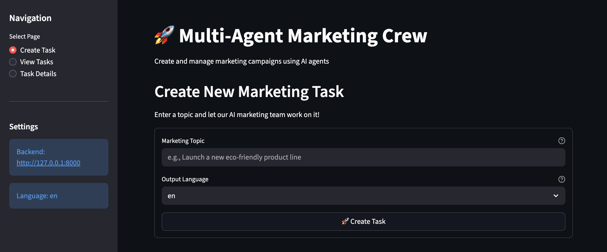

# 🚀 Multi-Agent Marketing Crew

<div align="center">

**An AI-powered marketing team that turns a single topic into a complete campaign — strategy, content, social posts, and timeline — orchestrated with CrewAI and powered by OpenAI.**

[](https://www.python.org/)
[](https://www.crewai.com/)
[](https://openai.com/)
[](https://fastapi.tiangolo.com/)
[](https://streamlit.io/)

</div>

---

## 🎯 About the Project

Multi-Agent Marketing Crew is an end-to-end AI application that automates marketing campaign creation. Given a single topic — say, _"Launch a new eco-friendly product line"_ — four specialized AI agents collaborate sequentially to produce a complete campaign: strategy, content plan, platform-specific social posts, and an execution timeline.

The system uses **CrewAI** to orchestrate the agents and **OpenAI** as the underlying LLM. Each agent has a defined role and area of expertise, and their output flows into the next agent's input — mirroring how a real marketing team would hand off work between specialists.

The application includes a FastAPI backend that exposes a REST API, a Streamlit frontend that provides an interactive dashboard with real-time task tracking, and a SQLite database that persists every campaign and its results.

---

## ✨ Features

| Feature                        | Description                                                                                           |
| ------------------------------ | ----------------------------------------------------------------------------------------------------- |
| 🤖 **Four-Agent Pipeline**     | Marketing Strategist, Content Creator, Social Media Specialist, and Campaign Manager work in sequence |
| 📝 **Complete Campaigns**      | One topic produces a full marketing strategy, blog outlines, social posts, and an execution plan      |
| 📊 **Interactive Dashboard**   | Streamlit UI for creating tasks, monitoring agents, and viewing deliverables                          |
| 🔄 **Real-time Task Tracking** | Watch tasks move through pending → in progress → completed                                            |
| 💾 **Persistent Storage**      | Every campaign is saved to SQLite and retrievable later                                               |
| 🌍 **Multi-language Output**   | Supports English, Spanish, French, German, Italian, and Portuguese                                    |
| ⚡ **REST API**                | Full FastAPI backend with auto-generated OpenAPI docs                                                 |
| 🎨 **Structured Outputs**      | Validated, type-safe deliverables using Pydantic models                                               |

---

## 🏗️ How It Works

```
┌─────────────────┐
│   User Input    │  "Launch a new eco-friendly product line"
└────────┬────────┘
         │
         ▼
┌─────────────────────────────────────┐
│      CrewAI Multi-Agent System      │
│                                     │
│  ┌───────────────────────────────┐  │
│  │  1. Marketing Strategist      │  │
│  │     - Market analysis         │  │
│  │     - Target audience         │  │
│  │     - Competitive positioning │  │
│  │     - Channel recommendations │  │
│  └──────────────┬────────────────┘  │
│                 │                    │
│  ┌──────────────▼────────────────┐  │
│  │  2. Content Creator           │  │
│  │     - Blog post outlines      │  │
│  │     - Key messaging points    │  │
│  │     - Content themes          │  │
│  └──────────────┬────────────────┘  │
│                 │                    │
│  ┌──────────────▼────────────────┐  │
│  │  3. Social Media Specialist   │  │
│  │     - Platform-specific posts │  │
│  │     - Instagram, Twitter,     │  │
│  │       LinkedIn content        │  │
│  └──────────────┬────────────────┘  │
│                 │                    │
│  ┌──────────────▼────────────────┐  │
│  │  4. Campaign Manager          │  │
│  │     - Timeline & milestones   │  │
│  │     - Success metrics         │  │
│  │     - Implementation steps    │  │
│  └──────────────┬────────────────┘  │
└─────────────────┼────────────────────┘
                  │
                  ▼
         ┌────────────────┐
         │   Campaign     │
         │  Deliverables  │
         └────────┬───────┘
                  │
                  ▼
         ┌────────────────┐
         │  SQLite DB     │
         │  (Persistent)  │
         └────────────────┘
```

Each agent is given a role, goal, and area of expertise. They run sequentially — each building on the previous agent's output — to produce a coherent final deliverable rather than four disconnected pieces.

---

## 🛠️ Tech Stack

<div align="center">

| Category                  | Technology          | Purpose                                       |
| ------------------------- | ------------------- | --------------------------------------------- |
| **🤖 AI / Orchestration** | CrewAI              | Multi-agent orchestration and task delegation |
|                           | OpenAI              | LLM powering strategy, content, and planning  |
|                           | LangChain           | LLM framework and abstractions                |
| **🌐 Backend**            | FastAPI             | Async REST API with built-in OpenAPI docs     |
| **💻 Frontend**           | Streamlit           | Interactive web dashboard                     |
| **💾 Database**           | SQLAlchemy + SQLite | Lightweight ORM and persistent storage        |
| **📦 Validation**         | Pydantic            | Type-safe models and request validation       |
| **⚙️ Tooling**            | uv                  | Fast Python package manager                   |
|                           | Python 3.10+        | Core language                                 |

</div>

---

## 📦 Project Structure

```
multi-agent-marketing-crew/
├── src/
│   ├── shared/                    # 🔧 Shared modules
│   │   ├── config.py              # Configuration & environment variables
│   │   ├── models.py              # Pydantic request/response models
│   │   └── database.py            # Database setup and session management
│   │
│   ├── backend/                   # 🚀 FastAPI backend
│   │   ├── main.py                # API endpoints
│   │   ├── db_models.py           # Database models
│   │   └── services/
│   │       ├── marketing_crew.py  # CrewAI multi-agent system
│   │       └── task_service.py    # Task management
│   │
│   └── frontend/                  # 🎨 Streamlit frontend
│       └── streamlit_app.py       # Interactive web interface
│
├── pyproject.toml                 # Dependencies & project config
├── .env.example                   # Environment variables template
├── .gitignore
└── README.md
```

---

## 🚀 Getting Started

### Prerequisites

- **Python 3.10+**
- **OpenAI API Key** ([get one here](https://platform.openai.com/api-keys))

### Installation

**1. Install uv** (if you don't have it):

```bash
curl -LsSf https://astral.sh/uv/install.sh | sh
```

**2. Clone and enter the project:**

```bash
git clone <repository-url>
cd multi-agent-marketing-crew
```

**3. Install dependencies:**

```bash
uv sync
```

**4. Set up your environment.** Create a `.env` file in the project root:

```bash
# Required
OPENAI_API_KEY=sk-your-api-key-here

# Optional
APP_LANGUAGE=en
BACKEND_HOST=127.0.0.1
BACKEND_PORT=8000
DATABASE_URL=sqlite+aiosqlite:///./marketing_team.db
```

> 💡 Never commit your `.env` — it's already in `.gitignore`.

---

## 🎮 Running the App

**1. Start the backend** (keep this terminal running):

```bash
uv run uvicorn src.backend.main:app --reload --host 127.0.0.1 --port 8000
```

The API runs at **http://127.0.0.1:8000**.

**2. Start the frontend** (in a new terminal):

```bash
uv run streamlit run src/frontend/streamlit_app.py
```

Open **http://localhost:8501** in your browser.

From the dashboard you can create new campaigns, watch agents work in real time, and browse all your past results.

### Using the API directly

The API is fully usable on its own — interactive Swagger docs are at **http://127.0.0.1:8000/docs**.

| Method | Endpoint           | Description                      |
| ------ | ------------------ | -------------------------------- |
| `GET`  | `/`                | API information                  |
| `GET`  | `/health`          | Health check                     |
| `POST` | `/tasks`           | Create a new marketing task      |
| `GET`  | `/tasks`           | List all tasks                   |
| `GET`  | `/tasks/{task_id}` | Get a specific task with results |

**Example — create a task:**

```bash
curl -X POST "http://127.0.0.1:8000/tasks" \
  -H "Content-Type: application/json" \
  -d '{
    "topic": "Launch a new eco-friendly product line",
    "language": "en"
  }'
```

**Response:**

```json
{
  "task_id": "550e8400-e29b-41d4-a716-446655440000",
  "topic": "Launch a new eco-friendly product line",
  "status": "pending",
  "created_at": "2025-01-15T10:30:00"
}
```

**Fetch the results:**

```bash
curl "http://127.0.0.1:8000/tasks/550e8400-e29b-41d4-a716-446655440000"
```

```json
{
  "task_id": "550e8400-e29b-41d4-a716-446655440000",
  "topic": "Launch a new eco-friendly product line",
  "status": "completed",
  "content_strategy": "Comprehensive marketing strategy...",
  "social_media_posts": [
    "Instagram post: 🌱 Introducing our new eco-friendly line...",
    "Twitter post: Excited to announce our sustainable product launch..."
  ],
  "blog_outline": "1. Introduction to eco-friendly products...",
  "campaign_ideas": [
    "Earth Day launch campaign",
    "Influencer partnership program"
  ]
}
```

---

## 💡 Example Use Cases

**Product launches**

- _"Launch a new eco-friendly product line"_
- _"Introduce our premium subscription service"_
- _"Announce the release of our mobile app"_

**Brand campaigns**

- _"Rebrand our company with a modern, tech-forward image"_
- _"Increase brand awareness in the Gen Z market"_
- _"Strategy for entering the European market"_

**Event marketing**

- _"Promote our annual tech conference"_
- _"Market our upcoming webinar series on AI"_

**Content marketing**

- _"Develop a content strategy for our SaaS platform"_
- _"Plan blog content for Q1 2025"_

**Seasonal campaigns**

- _"Holiday marketing campaign for an e-commerce store"_
- _"Back-to-school promotion strategy"_

---

## 📊 What Each Campaign Produces

| Deliverable               | What's In It                                                    |
| ------------------------- | --------------------------------------------------------------- |
| 📋 **Marketing Strategy** | Audience analysis, positioning, channel recommendations         |
| 📝 **Content Strategy**   | Blog outlines, messaging points, content themes                 |
| 📱 **Social Media Posts** | Platform-optimized content for Instagram, Twitter, and LinkedIn |
| 💡 **Campaign Ideas**     | Creative concepts and initiatives                               |
| 📅 **Campaign Plan**      | Timeline, milestones, KPIs, and implementation steps            |

---

## 🔧 Development

```bash
# Run tests
uv run pytest

# Format and lint
uv run black src/
uv run ruff check src/
```

---

## 🤔 FAQ

**How long does a campaign take to generate?**
Usually 2–5 minutes. Tasks run as background jobs, so the app stays responsive while one is in progress.

**Can the agents be customized?**
Yes — agent roles, goals, and backstories live in `src/backend/services/marketing_crew.py`. Existing agents can be tweaked, and new ones can be added.

**Can a different LLM be used?**
Yes. CrewAI supports multiple providers — change the LLM initialization in `marketing_crew.py` to point at a different model.

**Is this production-ready?**
This is a learning-oriented project. For real production use, additional layers like authentication, rate limiting, structured logging, monitoring, caching, and more thorough error handling would be needed.

**What languages does it support?**
English, Spanish, French, German, Italian, and Portuguese. Set per-task with the `language` parameter, or globally via `APP_LANGUAGE` in `.env`.

---

## 📚 Resources

- [CrewAI Documentation](https://docs.crewai.com/)
- [OpenAI API Reference](https://platform.openai.com/docs/)
- [FastAPI Documentation](https://fastapi.tiangolo.com/)
- [Streamlit Documentation](https://docs.streamlit.io/)
- [SQLAlchemy Documentation](https://docs.sqlalchemy.org/)
- [Pydantic Documentation](https://docs.pydantic.dev/)

---

## 📝 License

MIT License — see [LICENSE](LICENSE) file for details.

---

<div align="center">

⭐ Star this repo if you found it useful or interesting!

</div>
